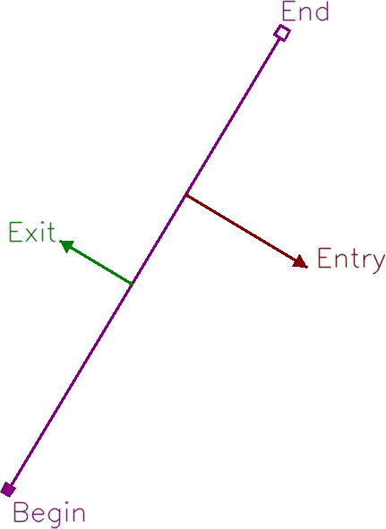

# Component_RegLine_OpenCV

A python library to draw a registration line with a transparent background using OpenCV. 
The registration line is a line that shows the direction of how the object which crosses the line is tracked.

## Example

There is an example in [samples](samples/registration_line) folder that demonstrates how to use the library to draw the following line:

You can update the sample code to draw the line in a different position, with different labels, or using other colors (ref. [config](registration_line/config.py) for more details).
